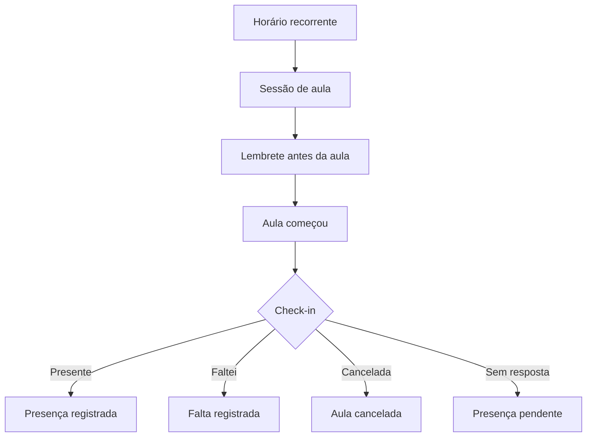
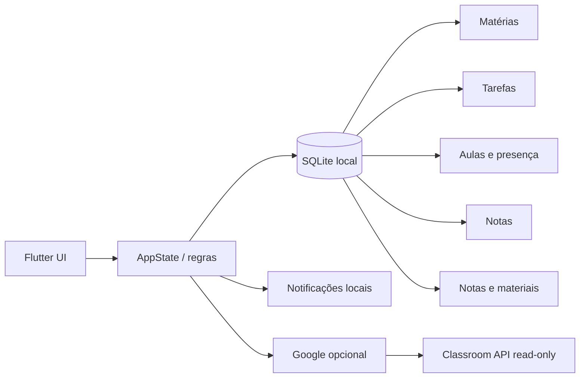

<div align="center">

# 🎓 Academia Flow

### Academic OS offline-first para matérias, prazos, notas, aulas, frequência e Google Classroom.


**Offline-first • Android + Windows • Google Classroom opcional**

</div>

---

## 📖 Sobre

**Academia Flow** é um organizador acadêmico em Flutter criado para concentrar a rotina universitária em um único aplicativo. O SQLite local é a fonte primária dos dados, portanto matérias, tarefas, notas, frequência, aulas e anotações continuam disponíveis sem conexão com a internet.

A integração Google é opcional. Quando configurada, o app pode vincular turmas do **Google Classroom**, importar atividades e acompanhar o estado de entrega sem transformar a nuvem em requisito para o funcionamento básico.

> Base atual: **2.5.10+18 — estabilização pré-2.6**

---

## ✨ Recursos principais

| Área | Recursos |
|---|---|
| 🏠 **Hoje** | Aula atual, próxima aula, timeline, presenças pendentes, entregas e métricas |
| 📚 **Matérias** | Professor, sala, atividades, notas, frequência, horários, materiais e anotações |
| ✅ **Atividades** | Kanban, prioridades, tipos, checklist, calendário e lembretes |
| 📊 **Desempenho** | Médias, frequência, risco acadêmico e simuladores |
| 🗓️ **Rotina** | Grade semanal, sessões geradas, aulas extras, reposições e calendário acadêmico |
| 🙋 **Presença** | Presente/Falta/Cancelada, histórico, meta por matéria e limite de faltas |
| 📖 **Biblioteca** | Anotações, links e referências de materiais |
| ☁️ **Google Classroom** | Login opcional, vínculo de turmas, importação e sincronização read-only |
| 🎨 **Experiência** | Light/Dark Mode, layout responsivo, animações e feedback de interação |

---

## 🙋 Rotina e presença

Cada horário recorrente gera sessões individuais de aula. Isso permite distinguir a grade planejada do que realmente aconteceu.



O fluxo suporta quantidade de aulas por bloco, lembrete configurável, feedback visual/háptico, presença pendente, aulas extras, reposições, feriados, recessos, cancelamentos, meta global ou específica por matéria, simulação de faltas e conteúdo vinculado à aula.

A presença/falta só pode ser registrada quando a sessão já começou. Uma aula futura ainda pode ser cancelada antecipadamente.

---

## ☁️ Google & Classroom

A integração funciona de forma **opcional e read-only**.

- login Google no Android e Windows;
- restauração local do perfil sem abrir seletor de conta ao entrar na tela;
- listagem de turmas ativas;
- vínculo de uma turma do Classroom a uma matéria local;
- importação de atividades com prazo;
- atualização de título, prazo, tipo e estado de entrega;
- atividades entregues podem ser marcadas como concluídas localmente;
- edições locais de descrição/checklist permanecem preservadas;
- desvincular uma turma remove o vínculo, não apaga as tarefas locais.

O SQLite continua sendo a fonte imediata do aplicativo.

---

## 📊 Desempenho acadêmico

O app calcula:

- média ponderada por matéria;
- média geral;
- frequência por matéria;
- frequência média apenas entre matérias com histórico de aulas;
- risco por média e frequência;
- nota necessária em uma próxima avaliação;
- faltas restantes conforme o total planejado;
- frequência projetada após novas faltas;
- resumo semanal de aulas já iniciadas.

---

## 📝 Materiais e anotações

É possível manter anotações gerais, por matéria ou vinculadas a uma aula, além de referências de material como PDF, slides, vídeo, link, documento ou repositório.

> Nesta versão, materiais representam **referências/links**. O app ainda não armazena arquivos binários nem os sincroniza em nuvem.

---

## 🏗️ Arquitetura



A base 2.5.10 inclui proteção contra dados legados inválidos, índices SQLite para consultas frequentes, operações críticas transacionais, isolamento de falhas de notificações e redução de rebuilds globais da interface.

---

## 🧰 Stack

| Tecnologia | Uso |
|---|---|
| **Flutter / Dart** | Interface e regras multiplataforma |
| **SQLite / sqflite** | Persistência Android |
| **sqflite_common_ffi** | Persistência Windows |
| **flutter_local_notifications** | Lembretes e check-in Android |
| **timezone** | Agendamento local |
| **google_sign_in** | Autenticação Google Android |
| **HTTP + OAuth PKCE** | Google/Classroom e autenticação Windows |
| **flutter_secure_storage** | Tokens e sessão local |
| **GitHub Actions** | Análise, testes e builds Release |

SDK Dart mínimo: **3.12.0**.

---

## 📁 Estrutura

```text
academia-flow/
├── .github/workflows/
│   ├── build-android.yml
│   └── build-windows.yml
├── lib/
│   ├── data/
│   ├── integrations/google/
│   ├── models/
│   ├── screens/
│   ├── services/
│   ├── state/
│   ├── theme/
│   └── widgets/
├── test/
├── tool/
├── pubspec.yaml
└── README.md
```

---

## 🚀 Desenvolvimento local

### Requisitos

- Flutter Stable;
- Android SDK para Android;
- Visual Studio com **Desktop development with C++** para Windows.

```bash
git clone https://github.com/VictorAms12/academia-flow.git
cd academia-flow
flutter pub get
```

Android/dispositivo conectado:

```bash
flutter run
```

Windows:

```bash
flutter config --enable-windows-desktop
flutter run -d windows
```

O arquivo `setup_windows.bat` também prepara as plataformas Android e Windows para desenvolvimento local.

---

## 📦 Builds oficiais

Os builds oficiais são gerados pelos workflows do GitHub Actions porque eles aplicam a configuração Android/Google e preservam a assinatura usada pelas versões anteriores.

### Android

Workflow: **Build Android APK**

Etapas principais:

```text
Checkout
→ Java / Flutter
→ geração do projeto Android
→ restauração e validação da assinatura
→ configuração Android + Google
→ validação dos recursos do launcher
→ flutter analyze
→ flutter test
→ flutter build apk --release
→ artifact
```

### Windows

Workflow: **Build Windows Desktop**

```text
Checkout
→ Flutter
→ geração do projeto Windows
→ configuração desktop
→ flutter analyze
→ flutter test
→ flutter build windows --release
→ pacote portátil ZIP
→ artifact
```

Os artifacts ficam disponíveis na execução correspondente em **GitHub Actions**.

---

## 🧪 Qualidade

A CI executa análise estática e testes antes dos builds Release. A estabilização 2.5.10 também adiciona testes para:

- dados/modelos legados ou inválidos;
- checklist e índices concluídos;
- média de frequência;
- resumo semanal sem contar aulas futuras;
- limites da navegação;
- modelos e normalização da integração Google.

---

## 🔐 Dados e privacidade

Os dados acadêmicos permanecem no banco SQLite local. A conta Google não é obrigatória e a integração Classroom só é usada quando o usuário a conecta.

Limpar os dados do aplicativo ou remover o banco local pode apagar informações. Backup e sincronização entre dispositivos ainda fazem parte da evolução planejada.

---

## ⚠️ Limitações atuais

- sincronização Android ↔ Windows ainda não disponível;
- sem backup em nuvem;
- materiais são referências/links, não armazenamento de arquivo;
- automação de notificações focada no Android;
- Windows portátil sem notificações locais completas até adoção de identidade/empacotamento apropriado;
- Google Classroom é read-only: o app não envia nem entrega atividades no Classroom.

---

## 🛣️ Próxima etapa: 2.6

Após a estabilização da base atual, os principais candidatos para a 2.6 são:

- [ ] sincronização offline-first Android ↔ Windows;
- [ ] backup e restauração;
- [ ] presença 2.0 com testes de persistência mais amplos e edição de histórico;
- [ ] central Hoje ainda mais contextual;
- [ ] sincronização incremental do Classroom;
- [ ] empacotamento/identidade Windows;
- [ ] acessibilidade e otimizações contínuas.

---

## 👨‍💻 Autor

Desenvolvido e mantido por **VictorAms12**.

GitHub: [@VictorAms12](https://github.com/VictorAms12)

---

<div align="center">

**Academia Flow** — organização acadêmica que acompanha a rotina, não apenas os prazos.

</div>
