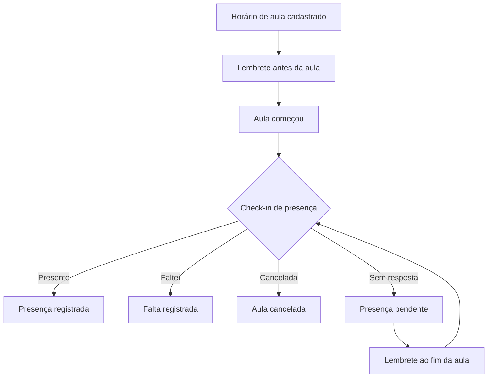
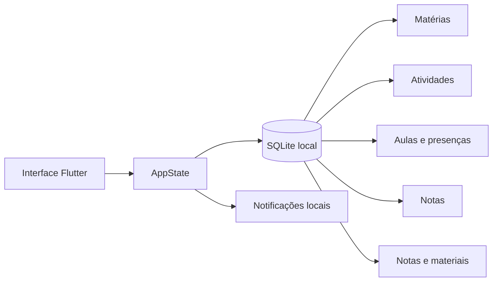

<div align="center">

# 🎓 Academia Flow

### Seu Academic OS para organizar matérias, prazos, notas, horários e frequência em um só lugar.


**Offline-first • Multiplataforma • Focado na rotina universitária**

</div>

---

## 📖 Sobre o projeto

**Academia Flow** é um aplicativo de organização acadêmica desenvolvido em Flutter para centralizar a rotina universitária sem depender constantemente de internet.

O projeto nasceu como um organizador de matérias e tarefas e evoluiu para um **Academic OS**: além de controlar prazos, notas, materiais e horários, o app acompanha a rotina de aulas, registra presença, calcula risco de faltas e ajuda o estudante a visualizar o que está acontecendo agora e o que vem em seguida.

Os dados permanecem armazenados localmente em SQLite, mantendo o aplicativo funcional mesmo sem conexão.

> Versão atual: **2.4.0 — Academic Routine**

---

## ✨ Destaques

| Área | O que o Academia Flow entrega |
|---|---|
| 🏠 **Hoje** | Próxima aula, aula em andamento, timeline do dia, entregas e presenças pendentes |
| 📚 **Matérias** | Professores, salas, notas, frequência, atividades, horários e materiais |
| ✅ **Atividades** | Kanban, prioridades, tipos de prazo, checklist e lembretes |
| 📊 **Desempenho** | Médias, frequência, alertas de risco e simuladores acadêmicos |
| 🗓️ **Rotina** | Grade semanal, aulas extras, reposições, feriados e calendário acadêmico |
| 🙋 **Presença** | Check-in por aula, histórico, faltas restantes e alertas progressivos |
| 📖 **Biblioteca** | Anotações, links, materiais e referências organizadas por matéria |
| 🎨 **Experiência** | Light/Dark Mode, animações, layout responsivo e interface desktop/mobile |

---

## 🙋 Controle inteligente de presença

A partir da v2.4, cada aula pode ser tratada como uma ocorrência individual, permitindo um histórico muito mais confiável que um simples contador de faltas.



O sistema suporta:

- **Presente / Faltei / Aula cancelada**;
- quantidade de aulas por bloco de horário;
- lembrete configurável antes da aula;
- recuperação de presença pendente ao final;
- histórico por disciplina;
- aula extraordinária e reposição;
- feriados, recessos e cancelamentos;
- frequência mínima global ou específica por matéria;
- cálculo de quantas faltas ainda são possíveis;
- simulador de frequência futura;
- estados de risco: **Seguro, Atenção, Risco e Limite**;
- sequência opcional de presenças;
- anotações, materiais e tarefas vinculados à aula.

---

## 🧠 Tela Hoje

A tela inicial funciona como um painel da rotina acadêmica atual, priorizando informação útil no momento certo.

Ela reúne:

- aula acontecendo agora;
- próxima aula e horário;
- timeline do dia;
- presenças ainda não confirmadas;
- entregas do dia;
- próximos prazos;
- métricas acadêmicas;
- atalhos para as principais ações.

---

## ✅ Atividades e prazos

As atividades podem representar diferentes tipos de compromisso acadêmico:

- atividade;
- prova;
- seminário;
- projeto;
- leitura;
- outros prazos.

Cada item pode possuir prioridade, status, descrição, checklist, data de entrega e lembretes automáticos.

A organização pode ser feita visualmente em fluxo **A fazer → Em andamento → Concluído**.

---

## 📊 Desempenho acadêmico

O Academia Flow calcula indicadores a partir dos dados cadastrados:

- média ponderada por disciplina;
- média geral;
- frequência por matéria;
- frequência média;
- matérias em situação de risco;
- nota necessária em uma próxima avaliação;
- limite de faltas;
- frequência simulada após faltas futuras.

Os limites de média e frequência podem ser personalizados nas configurações.

---

## 🗓️ Rotina e calendário acadêmico

A grade semanal permite cadastrar dias e horários de cada disciplina, incluindo:

- início e término;
- sala ou local;
- quantidade de aulas no bloco;
- antecedência do lembrete.

O calendário acadêmico também pode representar feriados, recessos, cancelamentos e outros eventos capazes de alterar a rotina normal.

---

## 📝 Notas, materiais e biblioteca

O projeto oferece uma camada de organização de conhecimento além das tarefas.

É possível manter:

- anotações gerais ou por matéria;
- anotações vinculadas a uma aula específica;
- tags;
- itens fixados;
- links e referências;
- PDFs, slides, vídeos, documentos e repositórios como referências de material;
- materiais vinculados a uma aula.

> Atualmente a biblioteca armazena **referências e links**. Upload/sincronização de arquivos não faz parte da v2.4.

---

## 🎨 Interface e Motion System

A interface foi construída para funcionar bem tanto em telas móveis quanto no desktop.

A identidade visual utiliza tons de **azul-petróleo**, superfícies neutras e detalhes em **dourado**, com suporte completo a tema claro e escuro.

O Motion System inclui transições de páginas, feedback de interação, animações de estado, alterações de tema e microinterações com foco em fluidez sem adicionar animações decorativas excessivas.

O Flutter utiliza o VSync disponibilizado pelo sistema, permitindo aproveitar telas de 60 Hz, 90 Hz ou 120 Hz quando o dispositivo e a carga de renderização permitem.

---

## 🏗️ Arquitetura

O Academia Flow segue uma abordagem **offline-first**.



O banco local é a fonte imediata dos dados. O aplicativo não precisa de servidor para abrir, consultar matérias ou registrar informações.

Essa arquitetura também prepara o projeto para uma futura camada de sincronização entre dispositivos sem abandonar o funcionamento offline.

---

## 🧰 Tecnologias

| Tecnologia | Uso |
|---|---|
| **Flutter** | Interface e aplicação multiplataforma |
| **Dart** | Linguagem principal |
| **SQLite / sqflite** | Persistência local no Android |
| **sqflite_common_ffi** | Persistência SQLite no Windows |
| **flutter_local_notifications** | Notificações e lembretes locais |
| **timezone** | Agendamento baseado em horário local |
| **GitHub Actions** | CI e geração automática de builds |

Versão mínima do SDK Dart definida pelo projeto: **3.12.0**.

---

## 📁 Estrutura principal

```text
academia-flow/
├── .github/
│   └── workflows/          # Builds Android e Windows
├── lib/
│   ├── data/               # SQLite e persistência
│   ├── models/             # Modelos acadêmicos
│   ├── screens/            # Telas da aplicação
│   ├── services/           # Notificações e serviços
│   ├── state/              # Estado global e regras de negócio
│   ├── theme/              # Design system e temas
│   ├── widgets/            # Componentes e formulários reutilizáveis
│   ├── app.dart
│   └── main.dart
├── test/                   # Testes Flutter
├── tool/                   # Scripts auxiliares de build
├── pubspec.yaml
└── README.md
```

---

## 🚀 Executando o projeto

### Pré-requisitos

- Flutter Stable;
- Dart compatível com o `pubspec.yaml`;
- Android SDK para Android;
- Visual Studio com **Desktop development with C++** para build Windows.

### Clonar

```bash
git clone https://github.com/VictorAms12/academia-flow.git
cd academia-flow
```

### Instalar dependências

```bash
flutter pub get
```

### Executar

Android/dispositivo conectado:

```bash
flutter run
```

Windows:

```bash
flutter config --enable-windows-desktop
flutter run -d windows
```

---

## 📦 Builds de release

### Android

```bash
flutter build apk --release
```

Saída padrão:

```text
build/app/outputs/flutter-apk/app-release.apk
```

### Windows

```bash
flutter build windows --release
```

O executável depende dos arquivos presentes na pasta `Release`; para distribuir a versão portátil, mantenha todo o conteúdo da pasta junto.

---

## ⚙️ CI com GitHub Actions

Pushes para a branch principal executam pipelines de build para **Android** e **Windows**.

Os workflows realizam, entre outras etapas:

```text
Checkout
↓
Setup Flutter
↓
flutter pub get
↓
flutter analyze
↓
flutter test
↓
Build Release
↓
Upload do artifact
```

Os pacotes resultantes ficam disponíveis na seção **Actions → execução do workflow → Artifacts**.

---

## 🔐 Dados e privacidade

Na v2.4, os dados acadêmicos são armazenados localmente no dispositivo usando SQLite.

Isso significa que:

- o app funciona offline;
- não existe conta obrigatória;
- não existe envio automático dos dados acadêmicos para um servidor;
- limpar os dados do aplicativo ou remover o banco local pode apagar as informações armazenadas.

Backup e sincronização entre dispositivos fazem parte da evolução planejada do projeto.

---

## ⚠️ Limitações atuais

- sincronização Android ↔ Windows ainda não está disponível;
- não há backup em nuvem;
- materiais são referências/links, não armazenamento de arquivos;
- notificações da rotina estão focadas no Android;
- no build portátil do Windows, notificações locais permanecem desativadas até a adoção de empacotamento com identidade, como MSIX.

---

## 🛣️ Roadmap

### Próximos passos planejados

- [ ] sincronização segura entre Android e Windows;
- [ ] pareamento de dispositivos por QR Code;
- [ ] arquitetura de sincronização offline-first com fila de alterações;
- [ ] conta e recuperação de dados opcionais;
- [ ] backup/exportação;
- [ ] empacotamento MSIX para Windows;
- [ ] notificações completas no desktop;
- [ ] evolução da biblioteca e anexos;
- [ ] melhorias contínuas de desempenho, acessibilidade e UX.

---

## 🧪 Qualidade

Antes da geração dos artifacts de release, os pipelines executam análise estática e testes Flutter:

```bash
flutter analyze
flutter test
```

A v2.4 possui builds automatizados para Android e Windows através do GitHub Actions.

---

## 👨‍💻 Autor

Desenvolvido e mantido por **VictorAms12**.

GitHub: [@VictorAms12](https://github.com/VictorAms12)

---

<div align="center">

**Academia Flow** — organização acadêmica que acompanha a rotina, não apenas os prazos.

</div>
