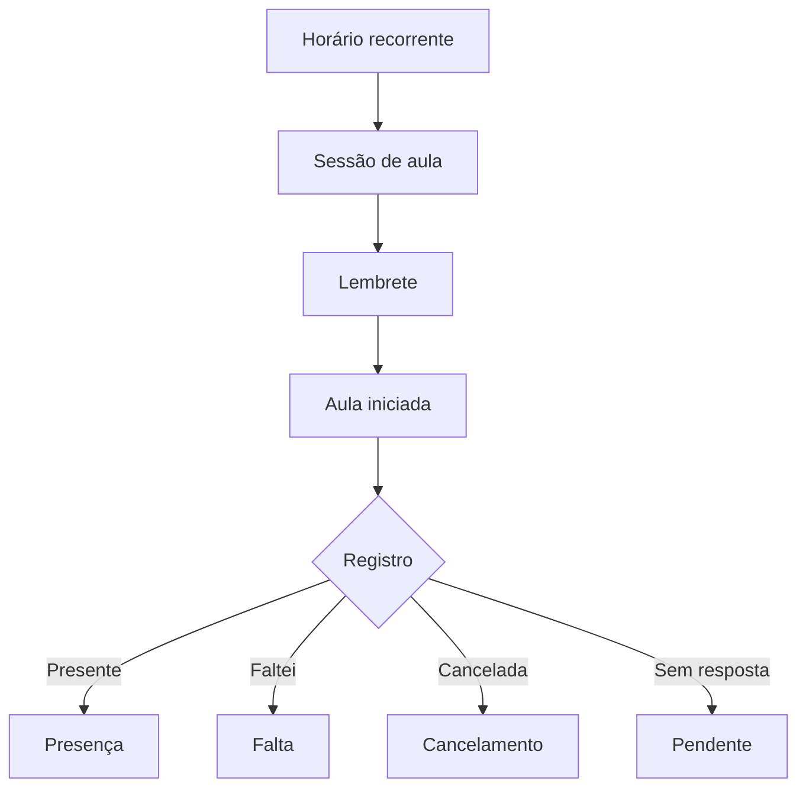
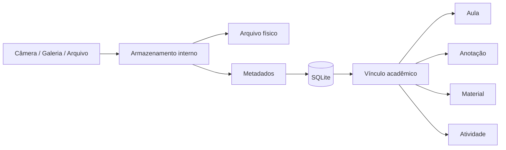
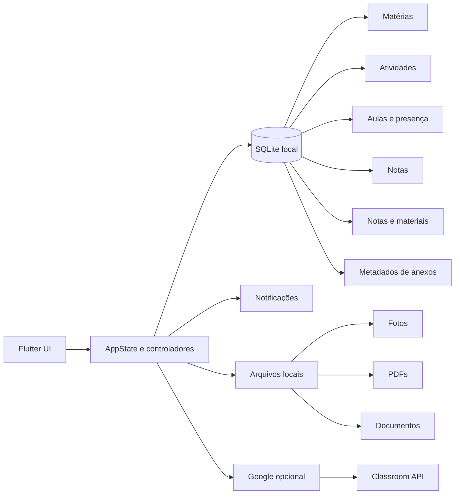
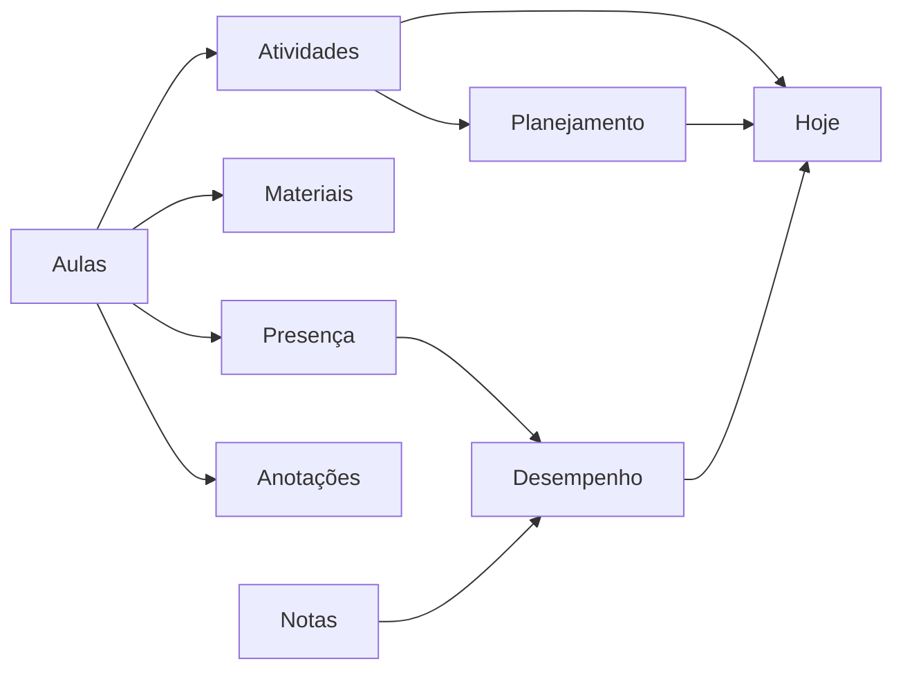

<div align="center">

# 🎓 Academia Flow

### Seu espaço acadêmico offline-first para organizar aulas, tarefas, frequência, notas, estudos e materiais.


**Offline-first • Android + Windows • Google Classroom opcional • Arquivos locais**

</div>

---

## 📖 Sobre o projeto

**Academia Flow** é um organizador acadêmico desenvolvido em Flutter para concentrar a rotina universitária em um único aplicativo.

O app foi pensado para funcionar primeiro no dispositivo: **matérias, aulas, tarefas, notas, frequência, anotações, materiais, planejamento e arquivos continuam disponíveis mesmo sem internet**. O SQLite local permanece como fonte principal dos dados acadêmicos.

A integração com o **Google Classroom** é opcional e somente leitura, servindo para trazer turmas e atividades para dentro da rotina do Academia Flow sem transformar a nuvem em requisito para usar o aplicativo.

> **Versão em desenvolvimento:** `2.6.4+23 — Anexos`

---

## ✨ O que o Academia Flow faz

| Área | Recursos |
|---|---|
| 🏠 **Hoje** | Aula atual, próxima aula, prioridades, carga acadêmica, presença pendente, avisos e ações rápidas |
| 📚 **Matérias** | Professor, sala, frequência mínima, horários, atividades, notas, materiais e anotações |
| ✅ **Atividades** | Kanban, calendário, prioridades, tipos, checklist, lembretes, vínculo com aula e foco por urgência |
| 🧠 **Planejamento** | Blocos semanais de estudo, duração, matéria, objetivo e conclusão |
| 🙋 **Presença** | Presente, falta, pendente, cancelada, histórico, meta, projeções e faltas restantes |
| 📊 **Notas** | Médias ponderadas, desempenho por matéria, simulação e nota necessária na próxima avaliação |
| 🗓️ **Rotina** | Grade semanal, sessões de aula, aulas extras, reposições, feriados, recessos e calendário acadêmico |
| 📖 **Biblioteca** | Anotações, materiais, tags, fixados, filtros, organização e abertura de links |
| 🔎 **Busca avançada** | Busca unificada por matérias, tarefas, notas, materiais, aulas e anexos |
| 📎 **Anexos** | Fotos, PDFs e documentos vinculados a aulas, anotações, materiais e atividades |
| ☁️ **Google Classroom** | Login opcional, turmas, vínculo com matérias e importação read-only de atividades |
| 🎨 **Experiência** | Tema claro/escuro, layout responsivo, animações, feedback de ações e interface adaptativa |

---

## 🏠 Hoje

A tela **Hoje** funciona como o centro da rotina diária.

Ela reúne, em um mesmo lugar:

- aula acontecendo agora;
- próxima aula;
- presença ainda não registrada;
- atividades de hoje;
- atividades atrasadas;
- avaliações próximas;
- risco de frequência;
- carga acadêmica do dia;
- blocos de estudo;
- avisos importantes;
- atalhos para registrar informações sem navegar por várias telas.

A ideia é que o usuário consiga abrir o app e responder rapidamente à pergunta: **“o que eu preciso fazer agora?”**

---

## 🙋 Presença e frequência

Cada horário recorrente gera sessões individuais de aula. Assim, a grade planejada fica separada do que realmente aconteceu.



O sistema considera a quantidade real de aulas por bloco (`classCount`) e oferece:

- meta global ou específica por matéria;
- histórico de presença;
- edição posterior;
- observação/motivo de falta;
- desfazer ações recentes;
- faltas restantes;
- projeção até o fim do período;
- simulação de **presença na próxima aula**;
- simulação de **falta na próxima aula**;
- impacto calculado usando a quantidade real de aulas do próximo bloco.

A presença ou falta só fica disponível depois que a aula começa. Cancelamentos futuros continuam permitidos.

---

## ✅ Atividades e foco

As atividades podem ser organizadas por status, prioridade, tipo e prazo.

Recursos disponíveis:

- Kanban;
- calendário mensal;
- checklist;
- atividade, prova, seminário, projeto, leitura e outros tipos;
- prioridade alta, média ou baixa;
- vínculo com matéria e aula;
- lembretes locais;
- duplicar atividade;
- adiar prazo;
- concluir rapidamente;
- desfazer ações recentes;
- ranking automático de urgência no **Foco de Atividades**.

O ranking considera prazo, atraso, prioridade, tipo e estado da atividade para destacar o que merece atenção primeiro.

---

## 🧠 Planejador semanal

Além de tarefas com prazo, o Academia Flow permite criar **blocos de estudo**.

Um bloco pode representar, por exemplo:

```text
Terça-feira • 14:30
Banco de Dados
Revisar normalização
Duração: 1h30
```

Os blocos podem ser vinculados a uma matéria, possuem duração estimada e podem ser marcados como concluídos.

Isso permite separar **o que precisa ser entregue** do **tempo reservado para estudar**.

---

## 📊 Notas e desempenho

O Academia Flow calcula e acompanha:

- notas por matéria;
- peso de cada avaliação;
- média ponderada;
- média acadêmica por disciplina;
- comparação com a média mínima configurada;
- simulação de próximas avaliações;
- cálculo automático de **quanto é necessário tirar na próxima prova**;
- frequência e desempenho apresentados em conjunto.

---

## 📖 Biblioteca acadêmica

A Biblioteca centraliza conteúdo de estudo e referência.

### Anotações

- título e conteúdo;
- matéria relacionada;
- vínculo opcional com uma aula;
- tags;
- fixar/desafixar;
- links;
- busca por conteúdo;
- filtros por matéria e tag;
- ordenação por data, título ou matéria.

### Materiais

- PDF;
- slides;
- vídeo;
- documento;
- repositório;
- link;
- outros tipos de referência;
- descrição e matéria relacionada;
- abertura direta de URLs.

### Anexos

A partir da versão 2.6.4, o Academia Flow também passa a armazenar **arquivos reais**, não apenas referências.

Os anexos podem ser vinculados a:

- aulas;
- anotações;
- materiais;
- atividades.

É possível adicionar:

- 📷 foto pela câmera;
- 🖼️ imagem da galeria;
- 📄 PDF;
- 📝 documento;
- 📦 outros arquivos selecionados no dispositivo.

Os arquivos são copiados para a área interna do Academia Flow para não dependerem do caminho original do arquivo selecionado.

---

## 📎 Como os anexos são armazenados

Arquivos binários **não são gravados dentro do SQLite**.



O banco guarda apenas informações como:

```text
Título
Nome original
Tipo
Tamanho
Data
Matéria
Vínculo acadêmico
Caminho interno
```

Isso evita inflar o banco e mantém o acesso aos arquivos mais eficiente.

---

## 🔎 Busca avançada

A busca global usa normalização e ranking por relevância.

Ela procura em:

| Categoria | Campos pesquisados |
|---|---|
| **Matérias** | nome, professor, sala |
| **Atividades** | título, descrição, checklist, matéria, tipo, status e prioridade |
| **Anotações** | título, conteúdo, tags, links e matéria |
| **Materiais** | título, descrição, URL, tipo e matéria |
| **Aulas** | matéria, data, horário, sala, observação e situação |
| **Anexos** | título, nome do arquivo, tipo, matéria e vínculo |

A normalização ignora diferenças de acentuação. Por exemplo:

```text
logica programacao
```

pode localizar conteúdo escrito como:

```text
Lógica de Programação
```

Também é possível restringir os resultados por categoria e matéria.

---

## ⚡ Nota rápida durante a aula

Quando uma aula está acontecendo, uma anotação pode ser criada diretamente naquele contexto.

Ela já fica vinculada automaticamente a:

```text
Matéria → Aula → Data
```

Depois pode ser encontrada novamente nos detalhes da aula ou na Biblioteca.

---

## ☁️ Google Classroom

A integração Google é **opcional e read-only**.

Atualmente oferece:

- login Google;
- Android e Windows;
- listagem de turmas ativas;
- vínculo entre turma do Classroom e matéria local;
- importação de atividades;
- atualização de título, prazo, tipo e estado de entrega;
- preservação de descrições e checklists criados localmente;
- tarefas entregues podem ser refletidas como concluídas localmente;
- desvincular uma turma não apaga as atividades locais.

O aplicativo continua funcionando normalmente sem uma conta Google conectada.

A configuração OAuth está documentada em `docs/GOOGLE_SETUP.md`.

---

## 🏗️ Arquitetura



O projeto segue uma abordagem **offline-first**: a interface grava e consulta o estado local primeiro. Integrações externas são complementares.

---

## 🧰 Stack

| Tecnologia | Uso |
|---|---|
| **Flutter / Dart** | Interface e regras multiplataforma |
| **SQLite / sqflite** | Persistência acadêmica Android |
| **sqflite_common_ffi** | Persistência Windows |
| **path_provider** | Diretórios privados para anexos |
| **image_picker** | Câmera e galeria |
| **file_picker** | Seleção de documentos e arquivos |
| **open_filex** | Abertura de arquivos anexados |
| **flutter_local_notifications** | Lembretes e rotina Android |
| **timezone** | Agendamento local |
| **google_sign_in** | Autenticação Google Android |
| **HTTP + OAuth** | Google Classroom e autenticação desktop |
| **flutter_secure_storage** | Tokens e sessão Google |
| **GitHub Actions** | Analyzer, testes e builds Release |

SDK Dart mínimo: **3.12.0**.

---

## 📁 Estrutura do projeto

```text
academia-flow/
├── .github/
│   └── workflows/
│       ├── build-android.yml
│       └── build-windows.yml
├── docs/
├── lib/
│   ├── data/
│   ├── integrations/
│   │   └── google/
│   ├── models/
│   ├── screens/
│   ├── services/
│   ├── state/
│   ├── theme/
│   ├── utils/
│   └── widgets/
├── test/
├── tool/
├── pubspec.yaml
└── README.md
```

---

## 🚀 Desenvolvimento local

### Requisitos

- Flutter Stable;
- Dart compatível com o projeto;
- Android SDK para Android;
- Visual Studio com **Desktop development with C++** para Windows.

Clone o projeto:

```bash
git clone https://github.com/VictorAms12/academia-flow.git
cd academia-flow
flutter pub get
```

### Android

```bash
flutter run
```

### Windows

```bash
flutter config --enable-windows-desktop
flutter run -d windows
```

---

## 📦 Builds oficiais

Os builds oficiais são realizados pelo **GitHub Actions** para preservar configurações importantes como assinatura Android, recursos do launcher, notificações e OAuth.

### 🤖 Android

Workflow: **Build Android APK**

```text
Checkout
   ↓
Java 17 + Flutter Stable
   ↓
Geração da plataforma Android
   ↓
Restauração da assinatura persistente
   ↓
Configuração Android + Google
   ↓
Validação dos recursos
   ↓
flutter analyze
   ↓
flutter test
   ↓
flutter build apk --release
   ↓
Artifact APK
```

A mesma identidade de assinatura deve ser mantida entre releases para que uma APK nova possa ser instalada **por cima da versão anterior sem apagar os dados**.

### 🪟 Windows

Workflow: **Build Windows Desktop**

```text
Checkout
   ↓
Flutter Stable
   ↓
Geração da plataforma Windows
   ↓
Branding desktop
   ↓
flutter analyze
   ↓
flutter test
   ↓
flutter build windows --release
   ↓
Pacote portátil ZIP
```

---

## 🧪 Qualidade

Antes das releases, a CI executa análise estática e a suíte de testes.

Entre os comportamentos cobertos estão:

- modelos e dados legados inválidos;
- checklist de atividades;
- média de frequência;
- resumo semanal sem contar aulas futuras;
- limites de navegação;
- integração Google/Classroom;
- normalização e ranking da busca avançada;
- serialização do planejador semanal;
- priorização de atividades;
- classificação de tipos de anexos;
- reconstrução dos vínculos dos anexos.

Comandos principais:

```bash
flutter analyze
flutter test
flutter build apk --release
```

---

## 🔐 Dados e privacidade

O **SQLite local** continua sendo a fonte principal dos dados acadêmicos.

A conta Google não é obrigatória. Quando conectada, a integração Classroom utiliza apenas os dados necessários para exibir turmas e atividades autorizadas pelo usuário.

Os anexos ficam armazenados localmente na área de documentos do aplicativo.

> Remover os dados do aplicativo pode eliminar banco e anexos locais. Um sistema completo de backup/restauração ainda faz parte do roadmap.

---

## ⚠️ Limitações atuais

- sincronização Android ↔ Windows ainda não está disponível;
- backup completo com anexos ainda não está implementado;
- Google Classroom permanece somente leitura;
- os anexos são locais e ainda não são sincronizados em nuvem;
- notificações avançadas continuam concentradas no Android;
- a versão Windows portátil possui limitações para notificações nativas do sistema.

---

## 🛣️ Roadmap

### Próximas evoluções

- [ ] backup e restauração incluindo anexos;
- [ ] anexos também diretamente no nível da matéria;
- [ ] compartilhamento/exportação de arquivos;
- [ ] sincronização incremental do Classroom;
- [ ] relatórios acadêmicos mais completos;
- [ ] inteligência de planejamento e carga semanal;
- [ ] sincronização opcional entre dispositivos;
- [ ] aprimoramentos contínuos de desempenho e acessibilidade.

### Ideias futuras

- [ ] widgets Android;
- [ ] exportação de semestre;
- [ ] histórico acadêmico por períodos;
- [ ] central de revisão e estudos;
- [ ] versão web complementar.

---

## 🧭 Filosofia do Academia Flow

O projeto busca evitar que a organização acadêmica vire apenas uma lista de tarefas.

A proposta é conectar:



Assim, a rotina, os conteúdos e o desempenho deixam de existir como áreas isoladas.

---

## 👨‍💻 Autor

Desenvolvido e mantido por **VictorAms12**.

GitHub: [@VictorAms12](https://github.com/VictorAms12)

---

<div align="center">

### 🎓 Academia Flow

**Organização acadêmica que acompanha a rotina, não apenas os prazos.**

</div>
