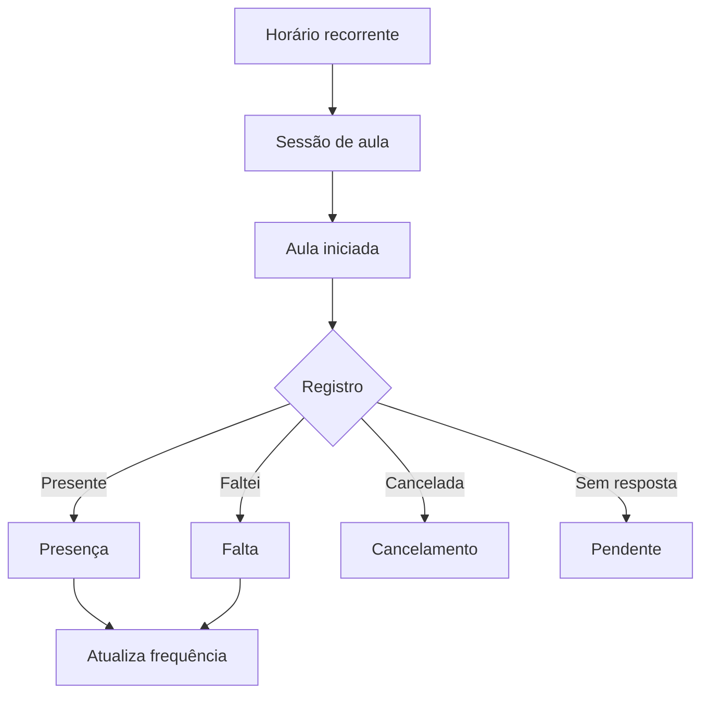
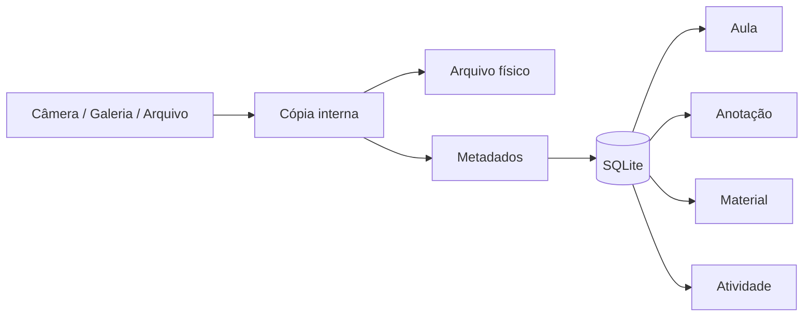
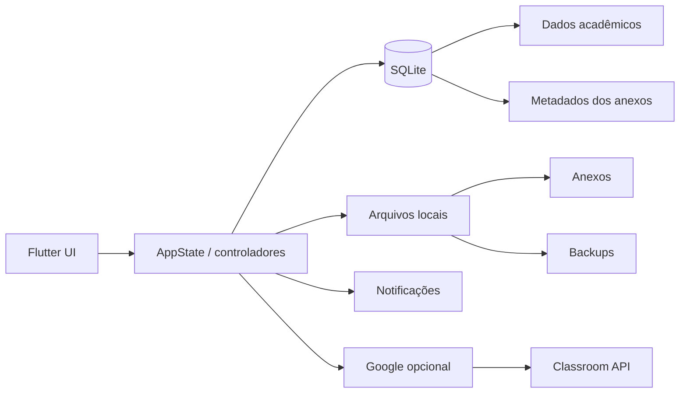

<div align="center">

# 🎓 Academia Flow

### Organização acadêmica offline-first para transformar aulas, prazos, presença, notas e materiais em uma rotina clara.


**Offline-first • Android + Windows • Google Classroom opcional • Anexos locais • Backup completo**

</div>

---

## 📖 Sobre

**Academia Flow** é um organizador acadêmico desenvolvido em Flutter para concentrar a rotina de estudos em um único aplicativo. O foco é manter o uso cotidiano simples sem sacrificar profundidade: matérias, horários, sessões de aula, frequência, tarefas, notas, planejamento, biblioteca e arquivos trabalham sobre a mesma base acadêmica.

O aplicativo segue uma abordagem **offline-first**. O SQLite local é a fonte principal dos dados e os anexos são armazenados dentro da área privada do aplicativo. A internet é necessária apenas para recursos externos, como o Google Classroom.

> **Versão atual:** `2.6.5+24 — Polimento, Backup e Segurança`

---

## ✨ Recursos

| Área | O que oferece |
|---|---|
| 🏠 **Hoje** | Aula atual, próxima aula, prioridades, carga do dia, avisos, presença pendente e ações rápidas |
| 📚 **Matérias** | Professor, sala, horários, frequência, notas, atividades, materiais e anotações |
| ✅ **Atividades** | Kanban, calendário, prioridade, tipo, checklist, lembretes, anexos e ranking de urgência |
| 🧠 **Planejamento** | Blocos de estudo por data, horário, duração, matéria, objetivo e conclusão |
| 🙋 **Presença** | Histórico editável, meta, faltas restantes e projeção da próxima aula presente/ausente |
| 📊 **Notas** | Média ponderada, desempenho e cálculo da nota necessária em uma próxima avaliação |
| 🗓️ **Rotina** | Grade semanal, sessões, aulas extras, reposições e calendário acadêmico |
| 📖 **Biblioteca** | Anotações, materiais, tags, fixados, filtros, ordenação e anexos |
| 🔎 **Busca avançada** | Pesquisa unificada por matérias, atividades, anotações, materiais, aulas e arquivos |
| 📎 **Anexos** | Câmera, galeria, PDFs e documentos vinculados ao contexto acadêmico |
| 🛡️ **Backup** | Backup `.afbackup`, anexos, integridade SHA-256, restauração e cópias automáticas |
| ☁️ **Classroom** | Login opcional, turmas, vínculos e importação read-only de atividades |
| 🎨 **Experiência** | Light/Dark Mode, interface responsiva, animações e feedback de operações |

---

## 🏠 Hoje: contexto antes de quantidade

A tela **Hoje** reúne as informações que normalmente exigiriam navegar por várias áreas:

- aula acontecendo agora;
- próxima aula;
- presença não respondida;
- tarefas para hoje e atrasadas;
- provas próximas;
- risco de frequência;
- carga acadêmica diária;
- blocos de estudo;
- avisos relevantes;
- atalhos para registrar conteúdo rapidamente.

A ideia é responder rapidamente: **“o que merece minha atenção agora?”**

---

## 🙋 Presença e frequência

Cada horário recorrente gera sessões individuais. Isso separa a **grade planejada** do que realmente aconteceu.



O cálculo respeita `classCount`, portanto um bloco equivalente a duas aulas impacta a projeção como duas aulas.

A tela de presença mostra:

- frequência atual;
- meta global ou específica da matéria;
- faltas contabilizadas e restantes;
- histórico editável;
- observações;
- projeção **se estiver presente na próxima aula**;
- projeção **se faltar na próxima aula**;
- situação em relação à meta.

---

## ✅ Atividades e planejamento

Atividades podem representar trabalho, prova, seminário, projeto, leitura ou outro prazo.

Recursos:

- Kanban e calendário;
- prioridades;
- checklist;
- lembretes;
- vínculo com matéria e aula;
- anexos;
- duplicação;
- adiar prazo;
- concluir/reabrir;
- ações com feedback e desfazer onde aplicável;
- **Foco de Atividades**, com ordenação por urgência.

O planejador semanal complementa os prazos com **blocos de estudo**, permitindo reservar tempo para uma matéria antes que ela vire uma urgência.

---

## 📊 Notas e desempenho

O Academia Flow acompanha:

- notas por matéria;
- peso das avaliações;
- média ponderada;
- média mínima configurável;
- risco acadêmico;
- nota necessária na próxima avaliação;
- frequência e desempenho no mesmo contexto.

---

## 📖 Biblioteca

A Biblioteca possui três áreas:

### 📝 Anotações

- título e conteúdo;
- matéria e aula vinculadas;
- tags;
- fixar/desafixar;
- links;
- busca textual;
- filtros e ordenação.

### 📚 Materiais

- PDF, slides, vídeo, documento, repositório, link e outros tipos;
- descrição;
- matéria relacionada;
- URL externa;
- anexos próprios.

### 📎 Anexos

- fotos da câmera;
- imagens da galeria;
- PDF;
- documentos;
- arquivos selecionados no dispositivo;
- vínculo com aula, anotação, material ou atividade.

Filtros específicos são isolados por aba para não permanecerem ativos de forma invisível ao trocar de contexto.

---

## 📎 Armazenamento de anexos

Arquivos binários não são colocados dentro do SQLite.



O banco guarda título, nome original, tipo, tamanho, data, matéria, vínculo acadêmico e caminho interno. Arquivos órfãos são limpos em segundo plano na inicialização.

---

## ⚡ Conteúdo da aula

A tela de uma aula funciona como um pequeno hub contextual.

A partir dela é possível:

- registrar presença/falta/cancelamento;
- criar e editar anotações;
- excluir uma nota rápida sem ir até a Biblioteca;
- adicionar material;
- criar atividade;
- anexar foto ou documento;
- gerenciar anexos dos conteúdos vinculados;
- criar reposição quando uma aula regular for cancelada.

---

## 🔎 Busca avançada

A pesquisa usa múltiplos termos, normalização de texto e ranking por relevância.

| Categoria | Campos pesquisados |
|---|---|
| **Matérias** | nome, professor e sala |
| **Atividades** | título, descrição, checklist, matéria, tipo, status e prioridade |
| **Anotações** | título, conteúdo, tags, links e matéria |
| **Materiais** | título, descrição, URL, tipo e matéria |
| **Aulas** | matéria, data, horário, sala, observação e situação |
| **Anexos** | título, nome do arquivo, tipo, matéria e vínculo |

`logica programacao`, por exemplo, pode localizar **Lógica de Programação**.

---

## 🛡️ Backup e Segurança

A versão 2.6.5 introduz backups completos no formato **`.afbackup`**.

Um backup pode incluir:

```text
perfil e preferências
matérias
horários
sessões de aula
presenças
tarefas e checklists
notas
calendário acadêmico
anotações
materiais
planejamento semanal
anexos físicos
```

### Integridade

Cada backup contém um manifesto com:

- versão do formato;
- versão do aplicativo;
- data de criação;
- contagens dos registros;
- SHA-256 do arquivo lógico de dados;
- SHA-256 individual de cada anexo.

Antes da restauração, o arquivo é validado. A restauração usa staging para anexos e transação no banco, reduzindo o risco de estado parcialmente restaurado.

> SHA-256 detecta alterações/corrupção, mas o `.afbackup` **não é criptografado nem assinado digitalmente**. Guarde backups exportados em um local confiável.

### Tipos de backup

- **Manual:** criado pelo usuário;
- **Automático:** opcional, executado em segundo plano conforme o intervalo configurado;
- **Segurança:** criado automaticamente antes de restauração ou exclusões em massa.

Retenção interna atual:

- até 3 backups manuais;
- até 5 automáticos;
- até 3 de segurança.

Backups internos pertencem aos dados do próprio aplicativo. Para proteção contra perda, desinstalação ou limpeza de dados, use **Criar e exportar** e mantenha uma cópia fora do app.

### Google

Tokens, credenciais OAuth e sessão Google **não são incluídos**. Após restaurar em outro dispositivo, basta conectar a conta novamente.

---

## ☁️ Google Classroom

A integração é opcional e read-only.

- login Google;
- listagem de turmas ativas;
- vínculo turma ↔ matéria local;
- importação de atividades com prazo;
- atualização de título, prazo e estado de entrega;
- preservação de conteúdo editado localmente;
- desvincular uma turma não apaga as tarefas locais.

Consulte `docs/GOOGLE_SETUP.md` para configuração OAuth.

---

## 🏗️ Arquitetura



A nuvem complementa o aplicativo; ela não é a fonte obrigatória da rotina acadêmica.

---

## 🧰 Stack

| Tecnologia | Uso |
|---|---|
| **Flutter / Dart** | Interface e regras multiplataforma |
| **SQLite / sqflite** | Persistência Android |
| **sqflite_common_ffi** | Persistência Windows |
| **path_provider** | Armazenamento privado |
| **image_picker** | Câmera e galeria |
| **file_picker** | Arquivos, importação e exportação |
| **open_filex** | Abertura de documentos |
| **archive** | Container ZIP do `.afbackup` |
| **crypto** | SHA-256 de integridade |
| **flutter_local_notifications** | Lembretes e rotina |
| **google_sign_in + HTTP** | Google e Classroom |
| **flutter_secure_storage** | Sessão/token Google |
| **GitHub Actions** | Analyzer, testes e builds Release |

SDK Dart mínimo: **3.12.0**.

---

## 📁 Estrutura

```text
academia-flow/
├── .github/workflows/
├── docs/
├── lib/
│   ├── data/
│   ├── integrations/google/
│   ├── models/
│   ├── screens/
│   ├── services/
│   ├── state/
│   ├── theme/
│   ├── utils/
│   └── widgets/
├── test/
├── tool/
├── pubspec.yaml
└── README.md
```

---

## 🚀 Desenvolvimento local

```bash
git clone https://github.com/VictorAms12/academia-flow.git
cd academia-flow
flutter pub get
flutter run
```

Windows:

```bash
flutter config --enable-windows-desktop
flutter run -d windows
```

---

## 📦 Builds oficiais

Os workflows do GitHub Actions preservam as configurações de release e executam validações antes de disponibilizar artifacts.

### Android

```text
Checkout
→ Java 17 + Flutter Stable
→ configuração Android
→ assinatura persistente
→ launcher / notificações / Google
→ flutter analyze
→ flutter test
→ flutter build apk --release
→ artifact APK
```

### Windows

```text
Checkout
→ Flutter Stable
→ configuração desktop
→ flutter analyze
→ flutter test
→ flutter build windows --release
→ pacote portátil
```

A assinatura Android é mantida entre releases para permitir atualização por cima de uma instalação anterior sem apagar os dados.

---

## 🧪 Qualidade

A suíte cobre regras acadêmicas, resiliência de modelos, busca, Google, planejamento e estruturas do backup. A CI exige analyzer e testes antes do build Release.

A versão 2.6.5 também passou por um passe de consistência focado em:

- menos ações duplicadas;
- feedback de operações demoradas;
- layout responsivo em formulários;
- filtros previsíveis;
- navegação mobile mais compacta;
- exclusões destrutivas protegidas por backup;
- manutenção de arquivos órfãos;
- nomes de recursos sem sufixos de versão na interface.

---

## 🔐 Privacidade

Os dados acadêmicos permanecem localmente. A conta Google é opcional. O Classroom é usado somente quando conectado pelo usuário.

Backups exportados podem conter informações acadêmicas e arquivos pessoais anexados. Como o formato atual não é criptografado, o usuário deve controlar onde essas cópias são armazenadas.

---

## ⚠️ Limitações atuais

- sem sincronização automática Android ↔ Windows;
- sem backup em nuvem próprio;
- `.afbackup` ainda não possui criptografia por senha;
- Google Classroom é read-only;
- recursos de notificações são mais completos no Android;
- backup automático local é executado quando o app é inicializado e o intervalo já venceu.

---

## 🛣️ Próximos passos

Depois da estabilização da 2.6.5, a próxima linha pode evoluir para um **Semestre Inteligente**, com calendário acadêmico mais completo, distribuição de avaliações, planejamento de carga e projeções de desempenho ao longo do período.

---

## 👨‍💻 Autor

Desenvolvido e mantido por **VictorAms12**.

GitHub: [@VictorAms12](https://github.com/VictorAms12)

---

<div align="center">

**Academia Flow** — organização acadêmica que acompanha a rotina, não apenas os prazos.

</div>
